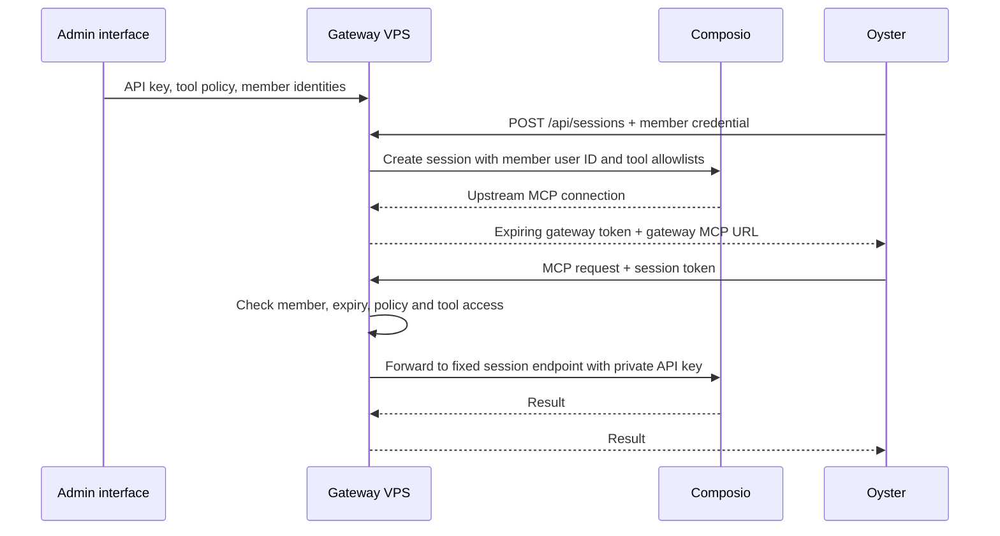

# Composio Gateway

A small self-hosted admin interface and MCP gateway. Enter a Composio project API key, fetch the tool catalog, disable tools, and issue restricted sessions to authenticated members.

## Run

Requires Node.js 22.19 or newer.

```sh
npm ci
npm start
```

Open `http://127.0.0.1:8788`. Read the generated admin token from `data/admin.token` on the server and enter it in the login form. The browser holds the admin credential only in memory; reloading locks the interface.

1. In **Connection**, enter your Composio project API key. The gateway automatically scans every catalog page and shows progress. A failed scan leaves the previous configuration intact.
2. In **Tool permissions**, search or filter by app, disable individual tools or all filtered tools, then save. Initially all fetched tools are enabled. The saved policy is shared by all members.
3. In **Members & sessions**, create a member using the Composio user ID associated with their app connections. Copy the member credential; it is only displayed once.
4. Use that credential to request a session, or use the interface's **Issue test session** button. Copy the returned MCP URL and Authorization header into Oyster's MCP configuration.

App OAuth remains available through the session's Composio connection-management tools. This version does not include a separate Gmail/GitHub OAuth connection page. A member cannot change their Composio user ID or session policy through the session endpoint.

## Request a session

```sh
curl https://gateway.example.com/api/sessions \
  -H "Authorization: Bearer $GATEWAY_MEMBER_TOKEN" \
  -H 'Content-Type: application/json' \
  -d '{}'
```

Example response:

```json
{
  "token": "<gateway-session-token>",
  "token_type": "Bearer",
  "expires_at": "2026-09-08T22:00:00.000Z",
  "mcp": {
    "type": "http",
    "url": "https://gateway.example.com/mcp",
    "headers": { "Authorization": "Bearer <gateway-session-token>" }
  }
}
```

Set `PUBLIC_URL` to obtain an absolute MCP URL in API responses. Without it, the API returns `/mcp`; the admin interface resolves this against its current origin. Do not use the member credential as an MCP session token. Request a new session on expiry or revocation. Oyster's automatic refresh integration is outside this standalone gateway; an API client must request and install the replacement connection.

A session lasts one hour by default. There are at most ten unexpired sessions per member. To release one early:

```sh
curl -X DELETE https://gateway.example.com/mcp \
  -H "Authorization: Bearer $GATEWAY_SESSION_TOKEN"
```

## Why MCP requests pass through the gateway

The installed Composio SDK places the project API key in `session.mcp.headers`. Forwarding that connection object would expose the project credential. This gateway instead issues a random, opaque bearer token and stores the upstream connection encrypted on the server.



The gateway only proxies a fixed set of MCP methods to the server-created Composio endpoint. It does not accept caller-supplied upstream URLs, API keys, user IDs, or policy overrides. Composio receives explicit toolkit and tool allowlists. The gateway additionally blocks disabled direct tool calls and batch tool slugs. Sandbox and proxy execution are disabled. Discovery, schemas, batch execution, and app connection management remain available.

Saving permissions, replacing the key after a successful scan, or syncing the catalog invalidates all gateway sessions and aborts active proxy requests. Revoking or rotating a member invalidates that member's sessions. Remote session deletion is attempted on revocation and expiry; local revocation remains effective if Composio is unavailable. An action already accepted by Composio cannot be undone by revoking its session.

Catalog refresh enables newly discovered tools by default. Until refresh, new tools are absent from the explicit allowlist. Review the refreshed catalog before issuing new sessions if you need to vet new additions.

## Configuration and VPS deployment

Environment variables are read directly; `.env` is not automatically loaded. Use `node --env-file=.env server.mjs` if you copy `.env.example` to `.env`.

| Variable              | Default         | Purpose                                             |
| --------------------- | --------------- | --------------------------------------------------- |
| `HOST`                | `127.0.0.1`     | Bind address                                        |
| `PORT`                | `8788`          | HTTP port                                           |
| `DATA_DIR`            | Project `data/` | Persistent SQLite database and encryption key       |
| `PUBLIC_URL`          | Unset           | Externally reachable HTTP(S) origin, without a path |
| `SESSION_TTL_SECONDS` | `3600`          | Session lifetime, 60–86400 seconds                  |
| `ADMIN_TOKEN`         | Generated file  | Optional administrator credential                   |

Use an HTTPS reverse proxy on a VPS so admin, member and session bearer credentials are protected in transit. The gateway does not trust forwarded Host headers to construct session URLs. Configure `PUBLIC_URL` explicitly.

A Dockerfile is included:

```sh
docker build -t composio-gateway .
docker run -d --name composio-gateway --restart unless-stopped \
  -p 127.0.0.1:8788:8788 \
  -e PUBLIC_URL=https://gateway.example.com \
  -v composio-gateway-data:/app/data \
  composio-gateway
docker exec composio-gateway cat /app/data/admin.token
```

Back up the entire data directory, including `encryption.key`; the database cannot be decrypted without it. The database contains hashed member/session tokens and AES-256-GCM-encrypted Composio credentials. Keep the data directory private: encryption does not protect secrets from an administrator who can read both the database and its local encryption key. Secrets are excluded from source control and the Docker build context.

## Validation

```sh
npm ci
npx playwright install chromium
npm run check
npm test
```

For an existing Chromium installation, set `PLAYWRIGHT_CHROMIUM_EXECUTABLE_PATH` to its executable when running tests. Tests include an actual browser flow at desktop and mobile widths, authorization boundaries, pagination, policy enforcement, session expiry/revocation, concurrent policy changes, batch filtering, and the real SDK's request serialization against a local fake Composio server. They do not require or exercise a live Composio account. The UI is static HTML/CSS/JavaScript, so no build step is needed.

## API summary

| Endpoint                             | Credential | Behavior                                                    |
| ------------------------------------ | ---------- | ----------------------------------------------------------- |
| `GET /health`                        | None       | Process health                                              |
| `GET /api/admin/status`              | Admin      | Connection and scan status; no secrets                      |
| `POST /api/admin/config`             | Admin      | `{ "apiKey": "…" }`; starts catalog scan                    |
| `POST /api/admin/refresh`            | Admin      | Rescan with stored key                                      |
| `GET /api/admin/tools`               | Admin      | Cached catalog                                              |
| `PUT /api/admin/policy`              | Admin      | `{ "disabled": ["TOOL_SLUG"] }`; revokes sessions           |
| `GET /api/admin/members`             | Admin      | Member list; no credentials                                 |
| `POST /api/admin/members`            | Admin      | `{ "name": "…", "userId": "…" }`; returns member token once |
| `POST /api/admin/members/:id/rotate` | Admin      | Replace credential and reactivate member                    |
| `POST /api/admin/members/:id/revoke` | Admin      | Disable member and invalidate their sessions                |
| `POST /api/sessions`                 | Member     | Empty object; issue restricted gateway session              |
| `POST /mcp`                          | Session    | Streamable HTTP MCP requests                                |
| `DELETE /mcp`                        | Session    | Revoke this session                                         |

Reference: [Composio session configuration](https://docs.composio.dev/docs/configuring-sessions), [sessions via MCP](https://docs.composio.dev/docs/sessions-via-mcp). The installed SDK source in `node_modules/@composio/core/src/models/ToolRouter.ts` supplies the upstream MCP authentication headers.
